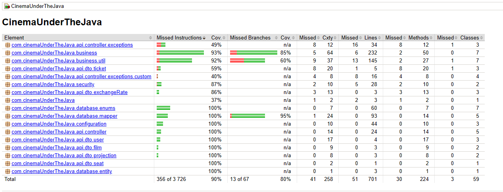

<h1 align="center">
  <a></a>
</h1>

## 📌 Table of Content

* [🎬 Project Description](#-project-description)
* [🎯 Main Features](#-main-features)
* [✔️ Tests](#-tests)
* [📚 Technology Stack](#-technology-stack)
* [💾 Usage](#-usage)
* [🧾 Using In Detail](#-using-in-detail)

## 🎬 Project Description

**Cinema Under The Java** is an application designed for cinema management with an integrated ticket generation system. Focused on core cinema
functionalities, this application streamlines and enhances the cinema-going experience.

## 🎯 Main Features

Navigating through core functionalities, **Cinema Under The Java** centers around simulating cinema-related features. This entails the ability to
register within the app, activating one's account through a welcome message sent to the registered email address. Additionally, similar to a cinema
application, users can peruse the film offerings and search for their preferred movie projects in the upcoming days. Upon selecting a desired film
projection, users need to choose suitable seats in their chosen row and proceed to reserve tickets. The ticket is automatically generated based on the
selected parameters and delivered in PDF format to the email address provided during registration. The ticketing system is seamlessly integrated with
discount functionalities and real-time currency exchange rates sourced from the API provided by the National Bank of Poland (NBP).

## ✔️ Tests

In the **Cinema Under The Java** tests play an important role, as they are the foundation of security and code quality. Thanks to testing, the
application can be better protected from bugs and provide reliable performance.

**Cinema Under The Java** prioritizes integration testing, encompassing unit tests, tests utilizing Mockito, and Rest Assured tests.

Lombok has been configured to add the @Generated annotation to its generated code, which eliminates the need to test each getter, setter, etc.,
individually. This enhancement streamlines the testing process and ensures the reliability of the generated code.
However, it's worth noting that the Mapstruct library generates a substantial amount of code that requires testing, potentially skewing the actual
code coverage achieved by tests. Despite the convenience offered by this library, I am considering manual mapping of entities to DTOs and vice versa
to avoid excessive testing of mappers.

To generate a code coverage report, the JaCoCo Java Code Coverage Library was used. The code coverage is: 89%/80% (Instructions/Branches) which is
presented below.

<h1 align="center">
  <a></a>
</h1>

## 📚 Technology Stack

**♢ Core:**

- Spring Boot
- REST
- Docker
- Gradle
- Lombok
- Slf4j
- SpringDoc OpenApi

**♢ DB:**

- PostgreSQL
- Flyway
- Hibernate
- Spring Data Jpa

**♢ Security:**

- Spring Security
- Spring Mail
- Jasypt

**♢ Tests:**

- JUnit Jupiter
- Mockito
- REST Assured

**♢ Other:**

- MapStruct
- and more..

## 💾 Usage

The easiest way (besides the traditional application launch) is to use Docker Compose.

1. Clone the repository:

``` 
$ git clone https://github.com/xGabrjel/cinema-under-the-java.git
```

2. Start the Docker Compose:

```
$ docker compose up
```

3. Explore the Swagger UI for API documentation:

```
http://localhost:2504/CinemaUnderTheJava/swagger-ui/index.html
```

## 🧾 Using In Detail

How to use Cinema Under The Java in detail? You can utilize tools like Postman or leverage the Swagger UI functionality for a comprehensive guide.
There are several endpoints available:


<h1 align="center">
  <a></a>
</h1>

1. Run the application through docker, as described in the previous section
2. Register as user at: 

POST http://localhost:2505/CinemaUnderTheJava/users/registration

Sample data:
```
   JSON:
   
   {
   "firstName": "Gabriel",
   "lastName": "Luczyszyn",
   "email": "gabriel.luczyszyn@gmail.com",
   "password": "password",
   "repeatedPassword": "password",
   "role": "USER"
   }
```
<h1 align="center">
  <a></a>
</h1>

3. Check your e-mail and click on activation link to activate your account
<h1 align="center">
  <a></a>
</h1>

4. You can check if your account is already verified by:

GET http://localhost:2505/CinemaUnderTheJava/users/1
   
(The only user in the application is ADMIN with id 999, so your account will search under id number 1)

<h1 align="center">
  <a></a>
</h1>

5. Choose the date you are interested in and search the available projects for the day.

GET http://localhost:2505/CinemaUnderTheJava/projections?date=2026-01-15
   
(In order not to update the base of available projections too quickly, they start from 2026-01-15, and end 2026-02-06)

<h1 align="center">
  <a></a>
</h1>

<h1 align="center">
  <a></a>
</h1>

6. You can check all available projections if you want:

GET http://localhost:2505/CinemaUnderTheJava/projections/all

<h1 align="center">
  <a></a>
</h1>

7. We choose projection number 1, so check available seats!

GET http://localhost:2505/CinemaUnderTheJava/projections/1

<h1 align="center">
  <a></a>
</h1>

<h1 align="center">
  <a></a>
</h1>

8. If we have found the places we are interested in, let's move on to tickets.


   - Choose the ticket type (NORMAL or DISCOUNTED if you are qualified for a discount)
   - Select the currency in which you would like to receive the ticket price
   - You can send request GET http://localhost:2505/codes and check available currencies
   - Enter the row number or seat number

POST http://localhost:2505/CinemaUnderTheJava/tickets/1/1
   
Sample data:
```
   JSON:
   
   {
   "ticketType": "NORMAL",
   "ticketCurrency": "PLN",
   "rowNumber": 8,
   "seatInRow": 8
   }
```


<h1 align="center">
  <a></a>
</h1>

<h1 align="center">
  <a></a>
</h1>


9. You just received a generated ticket in PDF format to the email address you provided during registration!

<h1 align="center">
  <a></a>
</h1>

10. If you want to add a new film or schedule a new projection for the day, you can do that too!

Check the current repertoire of films and see what you are missing

GET http://localhost:2505/CinemaUnderTheJava/films

<h1 align="center">
  <a></a>
</h1>

Too much? Want a specific category? no problem!
GET http://localhost:2505/CinemaUnderTheJava/films/category?category=HORROR

<h1 align="center">
  <a></a>
</h1>

Add new film to the database and save new projection for the day:


Sample data:
```
JSON:

{
  "title": "Learning Java!",
  "category": "HORROR",
  "filmDurationInMinutes": 120
}
```
<h1 align="center">
  <a></a>
</h1>


Sample data:
```
JSON:

{
  "date": "2027-01-18",
  "time": "20:20"
}
```

<h1 align="center">
  <a></a>
</h1>


